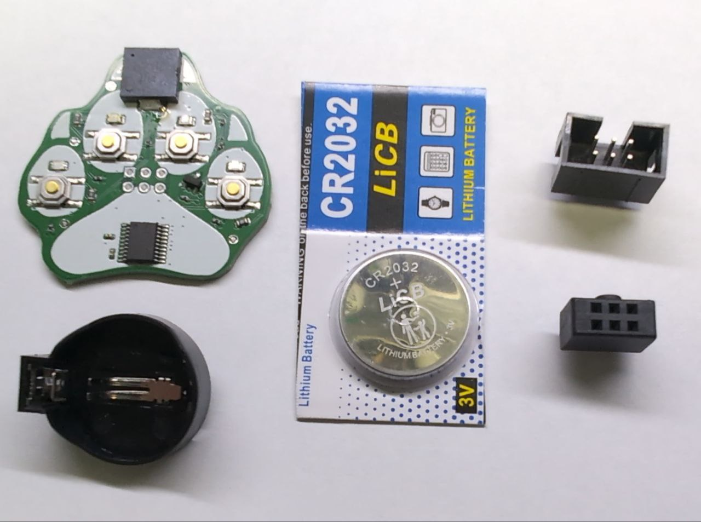
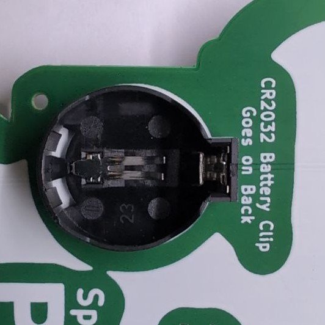
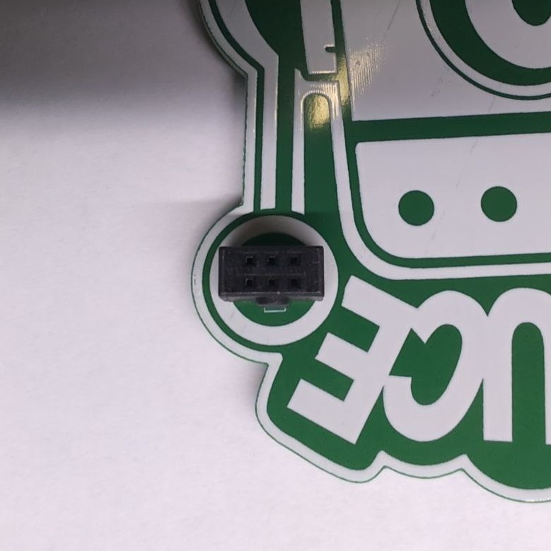
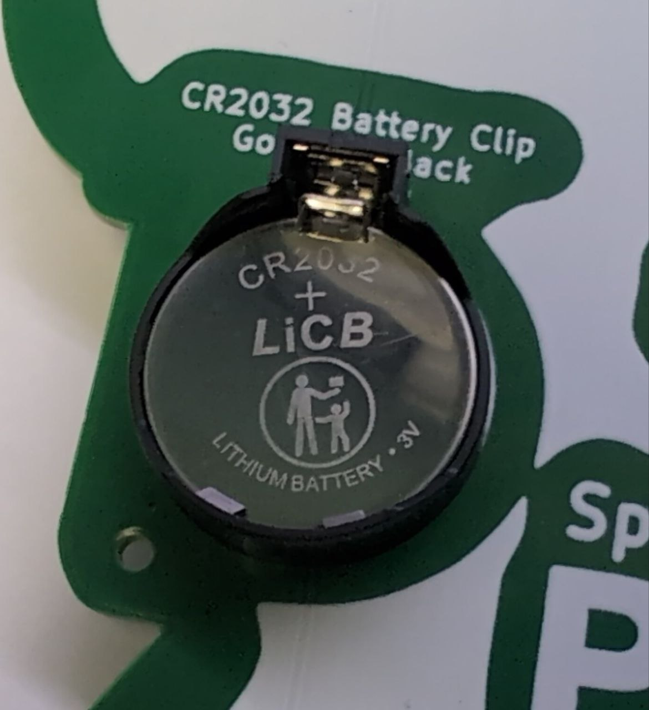
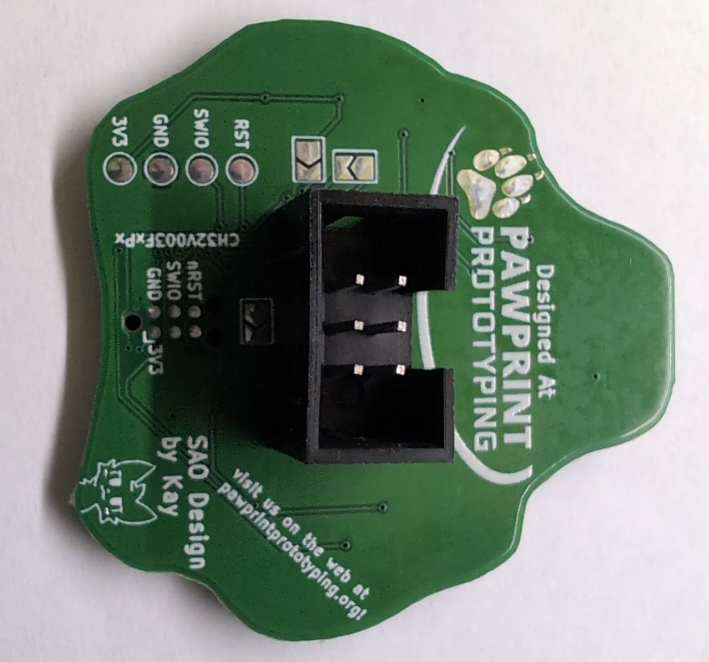

# Pawb SAO Assembly Guide

## First, check your parts!
You should have:

- One paw circuit board
- One battery clip
- One CR2032 battery
- One male SAO header
- One female SAO header 

If you are missing parts, please let us know! We will make it right.

## Assembling the Badge
Your badge is going to need some parts soldered to it:

On the back of your badge, solder the CR2032 battery clip. Make sure it 
lines up with the white outline. The little nub on the battery clip should 
be facing up.

Next, you will need to solder the female SAO header to the front of your 
badge. Make sure it lines up with the white outline. The little nub on 
the connector should be facing up.

Finally, put the CR2032 battery into the batter clip on the top of your 
badge. The side labelled with the `+` should be facing up.

## Assembling the Paw

You just need to solder one component here!

Solder the connector to the back of the paw. The notch in the connector 
should be facing up. 

## You're done!

Plug the paw into your badge, and press any button to start a game! It's 
a classic memory game, one with a copyrighted name that we can't mention 
here. We're sure you can figure it out :3
